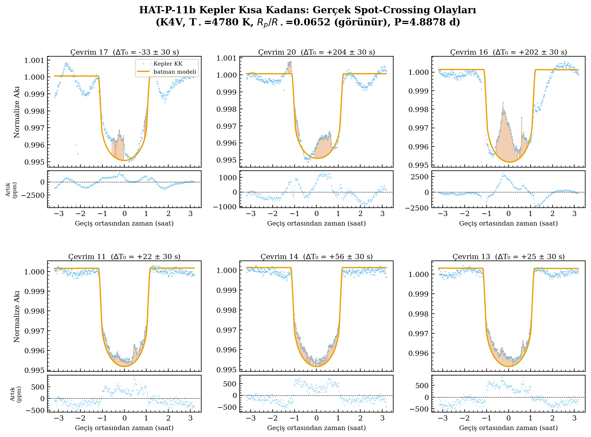
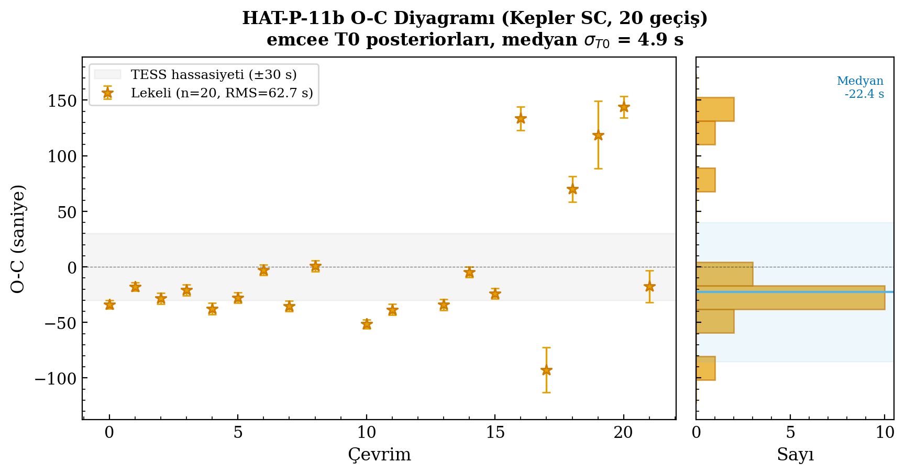
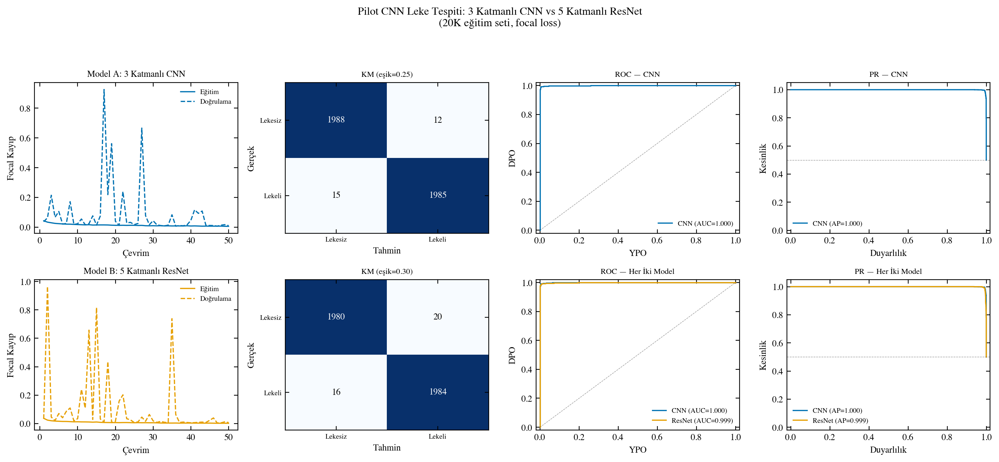
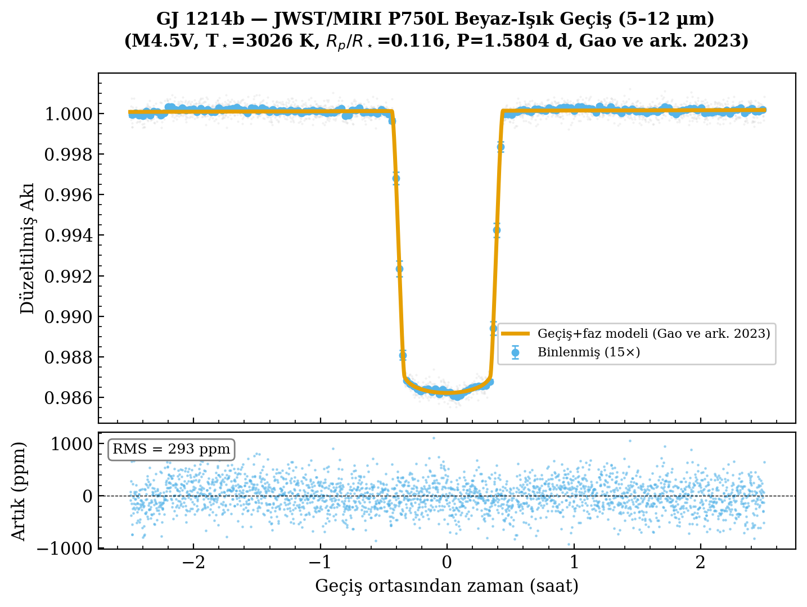
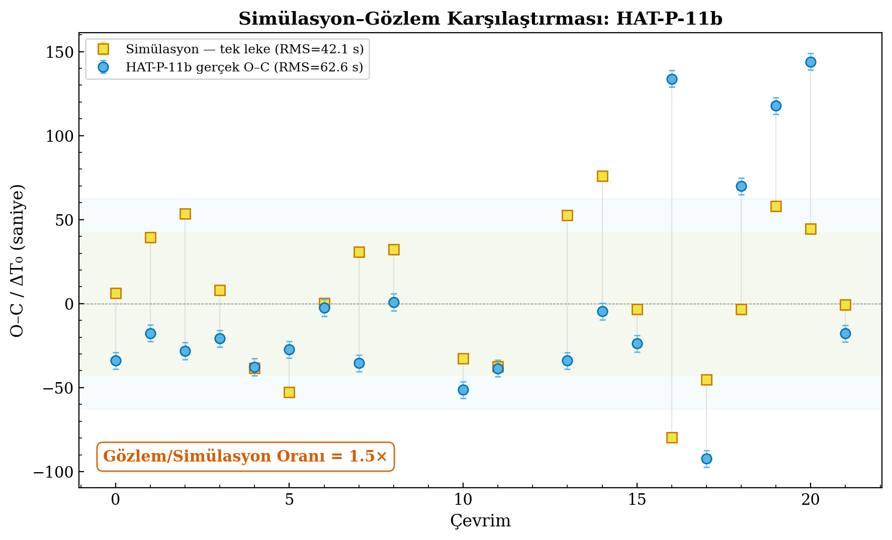
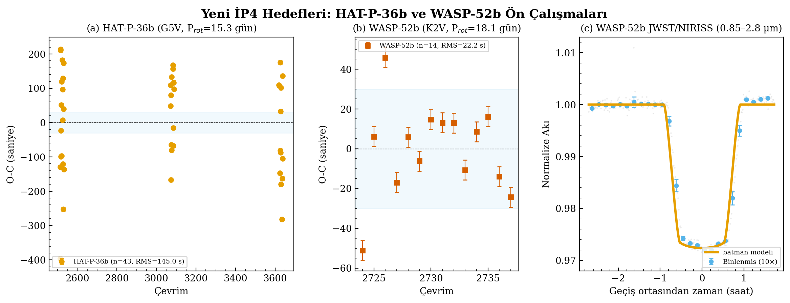

# Starspot Timing Systematics: 3501 Pre-Analysis

This page is the public information hub for the 3501 project pre-analysis and, if the project is accepted, for updated project materials, outputs, and progress notes.

**Comprehensive Characterization and Correction of Starspot-Induced Systematic Effects on Exoplanet Transit Mid-Time Measurements**

The purpose is to make the scientific basis inspectable: selected figures, numerical audit results, MAST/JWST source manifests, reproducibility notes, and reviewer-facing explanations are collected here.

## Reviewer Route

- Start with the [Science Audit](science-audit.md) for the main numerical checks.
- Use the [MAST/JWST Manifest](mast-query-summary.md) to inspect archive-source availability.
- See [Reproducibility](reproducibility.md) for how the public scripts and data summaries are intended to be used.
- See [Reviewer Information](reviewer-information.md) for a compact guide to the scientific claim, evidence level, and current limitations.
- See [Project Updates](project-updates.md) for the acceptance/status log and later project outputs.

## Key Audit Results

| Quantity | Audit result |
| --- | ---: |
| HAT-P-11b O-C RMS | 62.55 s |
| WASP-19b O-C RMS | 80.27 s |
| HAT-P-36b O-C RMS | 144.98 s |
| WASP-52b O-C RMS | 22.18 s |
| Homogeneous timing sample | 193 transits |
| Injection-recovery improvement | 32.4% |
| GJ 1214b white-light depth | 13,775 ppm |
| GJ 1214b white-light residual RMS | 293 ppm |

## Figures

### HAT-P-11b Spot-Crossing Examples

### HAT-P-11b O-C Diagram

### Synthetic CNN Metrics

### GJ 1214b JWST/MIRI White-Light Curve

### Simulation-Observation Validation

### Additional Validation Targets

## Public Materials

- [Science audit](science-audit.md)
- [MAST/JWST archive manifest](mast-query-summary.md)
- [Reproducibility notes](reproducibility.md)
- [Numerical audit JSON](data/numerical_claim_audit.json)
- [MAST query JSON](data/mast_query_summary.json)
- [Audit script](scripts/audit_numerical_claims.py)
- [Archive query script](scripts/query_primary_sources.py)
